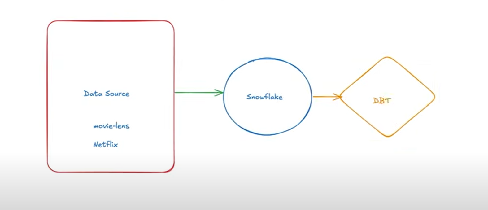

# 🎬 Movie Ratings Data Engineering Pipeline

This project demonstrates an end-to-end data engineering workflow for a Movie Ratings dataset scraped from [MovieLens](https://grouplens.org/datasets/movielens/). The pipeline is built using **Amazon S3**, **Snowflake**, and **DBT**, and is designed to produce clean, analytics-ready data tables (both fact and dimension) for downstream consumption.

---

## 📌 Project Overview

**Objective:**  
To build a scalable and reliable data pipeline that ingests raw movie ratings data, transforms it using best practices, and loads it into a Snowflake warehouse for analytics and reporting.

---

## 🧱 Tech Stack

| Tool/Platform     | Purpose                                     |
|------------------|---------------------------------------------|
| `Python`         | Web scraping of MovieLens data              |
| `CSV`            | Intermediate raw data format                |
| `Amazon S3`      | Raw data storage                            |
| `Snowflake`      | Cloud data warehouse                        |
| `DBT`            | Data transformation & modeling              |
| `SQL`            | Data querying & modeling                    |

---

## 🗃️ Data Flow Architecture

```
MovieLens (web scraped)
        ⬇
     CSV File
        ⬇
  Amazon S3 Bucket
        ⬇
 External Stage in Snowflake
        ⬇
     Snowflake Raw Table
        ⬇
   DBT Staging & Modeling
        ⬇
Analytics-Ready Tables (Facts & Dimensions)
```

---

## 📂 Project Structure

```
├── data/
│   └── movielens.csv                # Raw data file
├── dbt/
│   ├── models/
│   │   ├── staging/
│   │   │   └── stg_movies.sql       # Staging transformations
│   │   ├── marts/
│   │   │   ├── dim_movies.sql       # Dimension table
│   │   │   ├── dim_users.sql        # Dimension table
│   │   │   └── fact_ratings.sql     # Fact table
│   └── dbt_project.yml
├── snowflake/
│   └── s3_stage.sql                 # External stage configuration
├── README.md
```

---

## 🔧 Setup Instructions

### 1. **Data Extraction**
- Scrape or download the MovieLens dataset in CSV format.

### 2. **Upload to Amazon S3**
- Create a bucket (e.g., `movielens-pipeline-bucket`)
- Upload the CSV file using AWS CLI or console.

```bash
aws s3 cp movielens.csv s3://movielens-pipeline-bucket/
```

---

### 3. **Snowflake Configuration**
- Create a database and schema.
- Create a file format and external stage:

### Architecture

